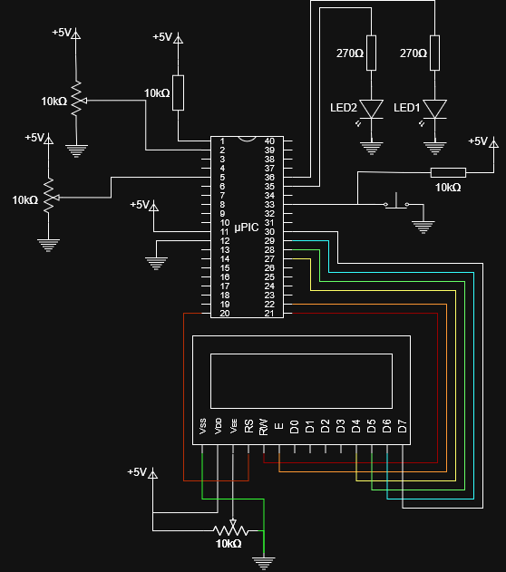
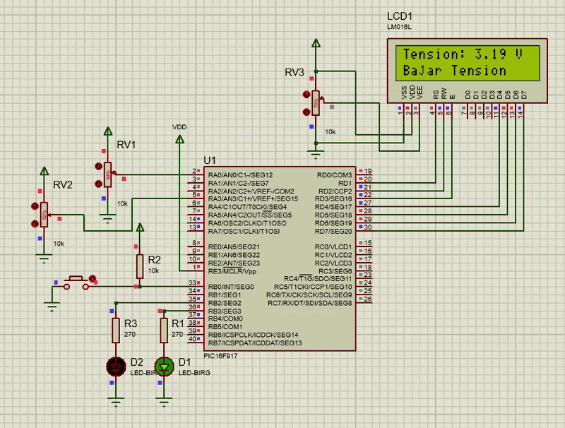

# MultitaskingPic16f917
Este proyecto desarolla un programa para un PIC que le permite medir una señal de voltaje variable (V), compara dicha señal con un voltaje de referencia (Vref) también variable, mostrar el valor analogico de V y generar parpadeos temporalizados si se preciona un botón; todo esto al mismo tiempo.

## Circuito



## Demostración de funcionamiento



## Especificaciones de Hardware

- Frecuencia de oscilacion: 8MHz
- 10 bits para la conversion ADC
- Reloj de oscilacion interno

## Modulos empleados

- Timer 1
- Timer 2
- CCP2
- Comparador Analógico
- Conversor Analógico

## Cálculos previos

### Cálculo del CCP2

Cargar CCPR2 para lanzar una conversión analógica cada 100ms.

$$
T = \frac{4\cdot PRESCALER\cdot CCPR2}{F_{osc}}
$$

Dado que se emplea un prescaler de 1:16, un reloj interno de 8MHz, se llega a que el valor de CCPR2 es 50000.

### Cálculo del TMR2

TMR2 debe llegar a hacer match con PR2 en un tiempo de 27.776ms repitiendose esto 18 veces para llegar a 499.968ms (muy cercano a los 500ms de duracion del encendido y apagado durante el parpadeo).

$$
T = \frac{4\cdot PRESCALER \cdot POSTCALER \cdot (PR2+1)}{F_{osc}}
$$

Trabajando con un prescaler y postcaler de 1:16 ambos, se llega a que el valor de PR2 es de 216.

### Cálculo del voltaje

Sabiendo que el valor de 0v corresponde al valor digital de 0, y que 5v corresponde a 1023, se procede a aplicar la siguiente formula para obtener un voltaje en unidades de centivoltios:

$$
V = ADRES\frac{500}{1023}
$$

Sin embjargo, en C esto consume mucha memoria, por lo que aplicando desplazamiento en bits se llega a:

$$
V = (ADRES>>1)-(ADRES>>6)+(ADRES>>8)
$$

Para la conversión se seleccionó una frecuencia de Fosc/16. Debido a que según el datasheet el $T_{AD}$ debe de ser de almenos 1.6us. Y al usarse un reloj interno de 8MHz se obtiene:

$$
T_{AD}= \frac{16}{F_{OSC}}=2us
$$

---
## Pseudocódigo

### Configuración
```text
//Configuración de los fusibles
Oscilador interno
WDT desactivado
Brownout desactivado
ADC de 10 bits
Reloj de 8MHz

//Variables globales
cont1 y cont2 (enteros)
cont1 ← 0
cont2 ← 0

//Configuracion de pines
PORTD salida (Pines del LCD)
B0 entrada
B2 y B3 salidas
B2 ← 0
B3 ← 0
A0 y A3 entradas analogicas

//Configuracion del conversor analógic0
Datos justificados a la derecha
A0 como canal analogico
Frecuencia de conversion analógica Fos/16
Encender módulo analógico

//Configuración del comparador analógico
A0 entrada inversora del opamp
A3 entrada noinversora del opamp
C1 //Bit del registro que es 1 si A0 < A3 y es 0 si A0 > A3
//Configuracion CCP2
Modo comparacion con reseteo del TMR1 y evento ADC
CCPR2 ← 50000

//Configuracion del TMR1
Prescaler 1:4
Fuente de reloj interna
Encender TMR1

//Configuracion del TMR2
Prescaler 1:16
Postcaler 1:16
PR2 ← 216

//Configuracion de las interrupciones
Habilitar interrupciones globales
Habilitar interrupciones por perifericos
Habilitar interrupcion por TMR2
```
### Programa principal

```text
Inicializar LCD
si(C1)	//Bit del registro del comparador analogico que es 1 si A0 < A3 y es 0 si A0 > A3
	Escribir: "Aumentar tension"
	B3 ← 0
sino
	Escribir: "Bajar tension"
	B3 ← 1
while(1)
	si(B0==0)
		B2 ← ~B2
		Encender TMR2
	si(Flag ADC)
		Limpiar Flag ADC
		v = ADRES*5/1023
		Escribir: "Tension: {v} V"
	si(Flag comparador)	//Hay un flag cada vez que la salida del opamp tiene un cambio
		Limpiar flag comparador
		si(C1)
			Escribir: "Aumentar tension"
			B3 ← 0
		sino
			Escribir: "Bajar tension"
			B3 ← 1
```

### Interrupción por TMR2

```text
cont1 ← cont1 + 1
si(cont1 es 18)
	cont1 ← 0
	cont2 ← cont2 + 1
	B2 ← ~B2
	si(cont2 es 5)
		cont2 ← 0
		Apagar TMR2
```

---
## Código

### Main
```c
#include "source.h"
#include "funciones.h"

int main(){
   configuracion();
   comparador();
   while(1){
      if(!(PORTB&1)){
	 delay_ms(20);
	 while(!(PORTB&1));
	 PORTB ^= (1<<2);
	 T2CON |= (1<<2);
	 }
      mensaje();
      }
   return 0;
}

```

### Funciones
```c
#include "source.h"

#define LCD_ENABLE_PIN  PIN_D3                                    ////
#define LCD_RS_PIN      PIN_D1                                    ////
#define LCD_RW_PIN      PIN_D2                                    ////
#define LCD_DATA4       PIN_D4                                    ////
#define LCD_DATA5       PIN_D5                                    ////
#define LCD_DATA6       PIN_D6                                    ////
#define LCD_DATA7       PIN_D7 

#include <lcd.c>

int cont1 = 0, cont2 = 0;

void configuracion(){
   //Configuracion del oscilador
   bit_set(OSCCON,6);bit_set(OSCCON,5);bit_set(OSCCON,4);	//8 MHz
   bit_clear(OSCCON,3);		//Device is running from the internal system clock
   bit_set(OSCCON,2);		//HFINTOSC is stable
   bit_set(OSCCON,0);		//Internal oscillator is used for system clock
   //Configuracion de los pines
   TRISD = 0x00;		//Puerto D (pines de la LCD) como salida
   TRISB = 0b00000001;		//RB0 como entrada y los demas como salida
   bit_clear(PORTB,2);		//RB2 en 0
   bit_clear(PORTB,3);		//RB3 en 0
   bit_set(ANSEL,0);		//RA0 como pin analogico
   bit_set(ANSEL,3);		//RA3 como pin analogico
   bit_set(TRISA,0);		//RA0 como entrada
   bit_set(TRISA,3);		//RA3 como entrada
   //Configuracion analogica
   bit_set(ADCON0,7);		//Right justified
   bit_clear(ADCON0,6);		//Voltage Reference VSS
   bit_clear(ADCON0,5);		//Voltage Reference VDD
   bit_clear(ADCON0,4);bit_clear(ADCON0,3);bit_clear(ADCON0,2);		//AN0 es el canal analogico
   bit_set(ADCON1,6);bit_clear(ADCON1,5);bit_set(ADCON1,4);		//FOSC/16
   bit_set(ADCON0,0);		//A/D converter module is operating
   //Configuracion del comparador analógico
   bit_clear(CMCON0,4);		//C1 Output not inverted
   bit_set(CMCON0,2);bit_clear(CMCON0,1);bit_clear(CMCON0,0);		//Configuracion normal
   //Configuracion CCP2
   bit_set(CCP2CON,3);bit_clear(CCP2CON,2);bit_set(CCP2CON,1);bit_set(CCP2CON,0);//sets TMR1 and starts an A/D conversion
   //Para alcanzar una interrupcion cada 100ms = 4*4*(CCPR2)/(8MHz)
   //Se llega a que el valor de CCPR2 = 50000
   CCPR2H = 50000 >> 8;
   CCPR2L = 50000 & 0xFF;
   //Configuracion TMR1
   bit_set(T1CON,5);bit_clear(T1CON,4);		//1:4 Prescale Value
   bit_clear(T1CON,1);		//Internal clock (F OSC/4)
   bit_set(T1CON,0);		//Timer1 On
   //Configuracion TMR2
   T2CON = 0b01111011;		//Precaler 1:16 y postcaler 1:16
   //TMR2 debe llegar al match en 27.776ms repitiendose esto 18 veces lo que da 499.968ms (muy cercano a 500ms)
  //Esto se llega al aplicar la formula 0.027776 = 4*16*16*217/8M 
   PR2 = 216;	//Porque 217 = PR2 + 1  
   //Configuracion Interrupciones
   bit_set(INTCON,7);		//Enables all unmasked interrupts
   bit_set(INTCON,6);		//Enables all unmasked peripheral interrupts
   bit_set(PIE1,1);		//TMR2 Interrupt Enable bit
   //Inicializacion de la LCD
   lcd_init();			
   delay_ms(10);
}

void comparador(){
   lcd_gotoxy(1, 2);		//Posicionamiento en la segunda fila
   if(!((CMCON0>>6)&1)){
      lcd_putc("Bajar Tension   ");//Mensaje
      PORTB|=(1<<3);
      }else{
	 PORTB &=~(1<<3);
	 lcd_putc("Aumentar Tension");//Mensaje
      }
}

void mensaje(){ 
   if((PIR1>>6)&1){
      PIR1 &= ~(1<<6);
      int16 x = ADRESH;
      x = x<<8;
      x = x + ADRESL;
      x = (x>>1)-(x>>6)+(x>>8);//Equivalente a la operacion x*500/1023
      char u = x/100 + '0';
      int d = x%100;   
      lcd_gotoxy(1,1);
      lcd_putc("Tension: ");
      lcd_putc(u);
      lcd_putc('.');
      lcd_putc(d/10 + '0');
      lcd_putc(d%10+'0');
      lcd_putc(" V");
   }
   if((PIR2>>5)&1){
      PIR2 &= ~(1<<5);
      comparador();
   }
}
   
#int_timer2
void Int_TMR2(){
   cont1++;
   if(cont1==18){	//Repetir 18 veces para llegar a 500ms
      cont1=0;
      cont2++;
      PORTB ^= (1<<2);	//Parpadeo
      if(cont2==5){	
	 cont2=0;
	 T2CON &= ~(1<<2);
	 }
      }
}
```
